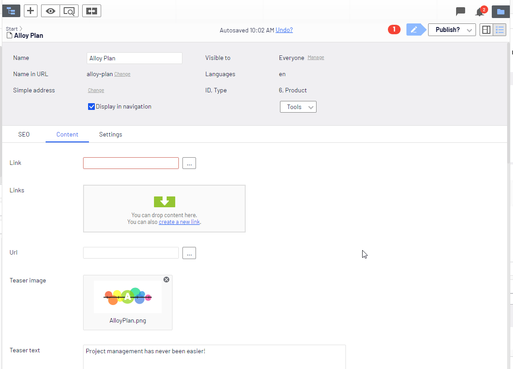

[](http://world.episerver.com/cms/)
# Episerver PropertyLinkItem
By default, Episerver does not allow developer to use LinkItem as property type, this small plugin will do that.

Normally you can do a trick by adding validation to allow LinkItemCollection to have max limit to 1, but in some case it is not good from editor's perspective.

With PropertyLinkItem, dev can have property as below
```
public virtual LinkItem Link { get; set; }
```


